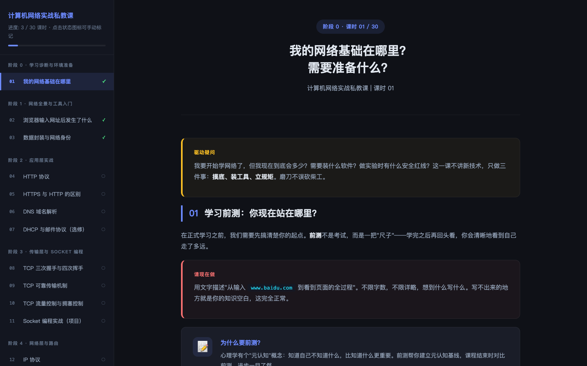
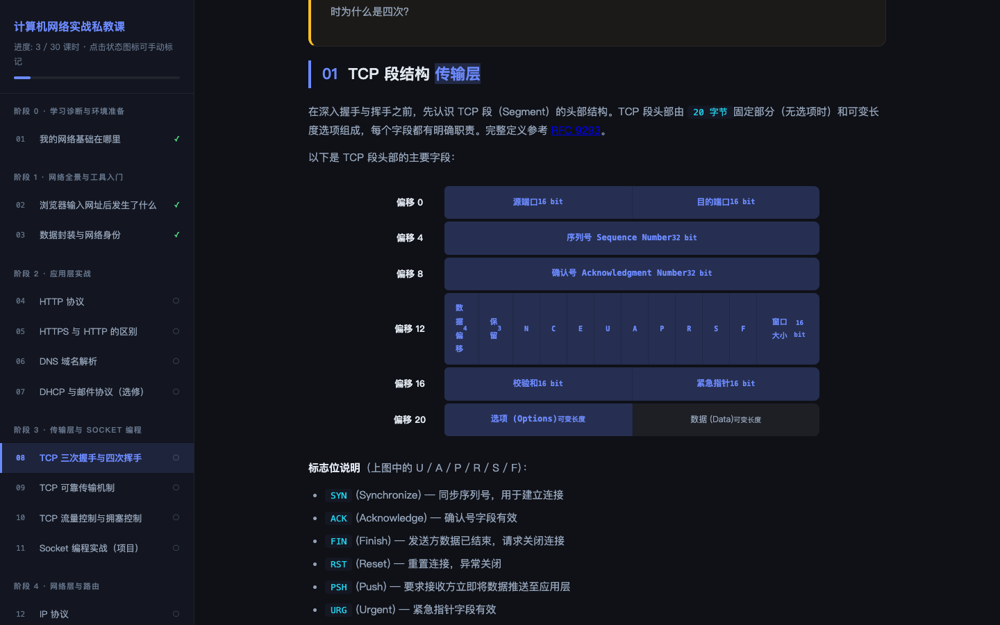
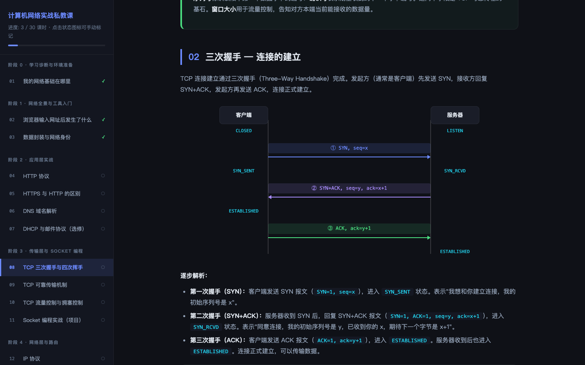
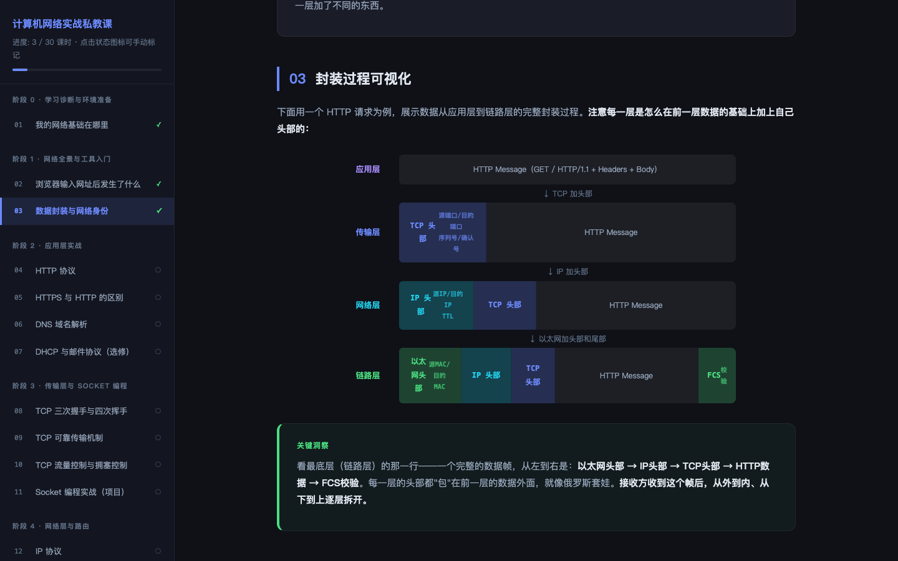
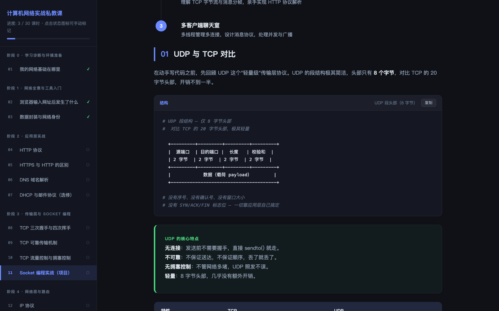
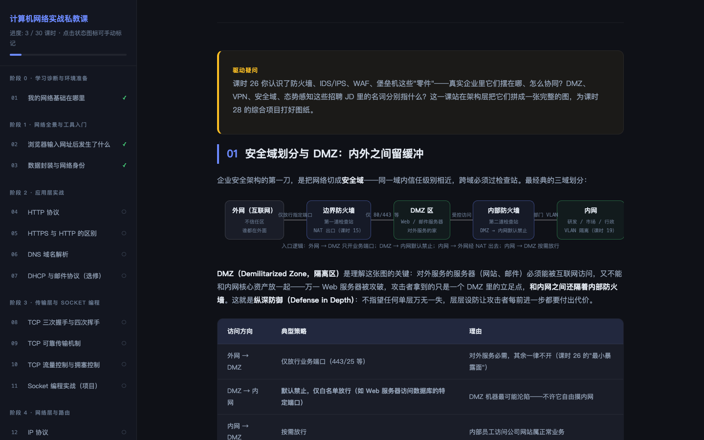

# 计算机网络实战私教课

> 一门 30 课时 + 尾声的计算机网络实战课程：单文件 HTML 交互教材，从分层模型讲到 TLS 握手、iptables、企业网综合项目与故障定位考试。

**[📖 在线阅读课程](https://holyhighhh.github.io/net-course-portfolio/)** · [📋 修复日志 CHANGELOG](CHANGELOG.md) · [📑 课程计划与质量规范](docs/course-plan.md)

---

## 课程界面

所有图表均为纯 HTML/CSS 绘制（无图片依赖），截图取自线上版真实渲染：

| 课程总览 · 9 阶段 30 课时 · 手动标记进度 | TCP 段结构 · 与 RFC 9293 对照 |
|---|---|
|  |  |

| 三次握手时序图（纯 CSS 绘制） | 数据封装结构图 |
|---|---|
|  |  |

| Socket 实战代码 · 语法高亮 + 复制按钮 | 企业安全域拓扑（课时 27） |
|---|---|
|  |  |

---

## 这个仓库展示什么

课程本体之外，这个仓库更想展示的是一套**AI 辅助开发的质量工程实践**：分阶段交付、每阶段自查、两轮全课程审查、逐项磁盘取证、版本化管理。课程内容由 AI 辅助生成，**需求设计、技术决策、审查质疑、验收标准与版本管理由本人主导**——审查环节发现并纠正的问题包括协议事实错误（如 TCP 头部保留位与 RFC 9293 不符）、拓扑逻辑颠倒（故障注入方向反了）、交叉引用失准等 20 余处硬伤。

### 版本管理

| 版本 | 日期 | 说明 |
|---|---|---|
| 0.1 – 0.7 | 08-03 ~ 08-25 | 开发期：9 个阶段逐段交付 + 同轮自查修复（回溯性编号，见 CHANGELOG） |
| [v1.0](../../tree/v1.0) | 2026-08-25 | 首个正式版：课程完结 + 第一轮全课程审查（10 项修复） |
| [v1.1](../../tree/v1.1) | 2026-08-28 | 第二轮全课程深度审查：12 项修复 + 版本体系建立 |

**如何验证修复是真实的**：`git diff v1.0 v1.1` 的每一处变更与 [CHANGELOG.md](CHANGELOG.md) 中 v1.1 的 12 个条目一一对应。例如条目 11（课时 30 标题对齐）对应 diff 中 `结业答辩 → 口述答辩` 的一行——双侧可查：新措辞存在、旧措辞全文件零残留。

> 说明：v1.0 提交为**回溯导入**——由 v1.1 按日志记录反向应用 12 项修复重建的文件态，提交信息中已注明。0.x 开发期无逐字 diff 留存，历史以 CHANGELOG 回溯记录为准。

### 质量流程

```
分阶段交付（9 阶段）
   └─ 每阶段交付后：结构验证（div 标签平衡 / 导航链完整 / 交叉引用抽查）
       + 内容自查（RFC 与教材对照）+ 用户报障响应
全书完结
   ├─ 第一轮：新鲜人审查 —— 放弃过程记忆，以首次阅读的评审视角通读全书
   │    → 10 项修复 + 4 项误判复核撤回（详见 docs/reviews/）
   └─ 第二轮：8 维度深度审查 —— 协议标准 / 命令配置 / 内部一致性 / 拓扑
        / 交叉引用 / 教学设计 / 语言质量 / JS 功能
        → 12 项修复 + 2 项评审决策不修改（详见 docs/reviews/）
```

流程中沉淀的纪律（细节见审查报告）：

- **磁盘取证**：任何"已修复"的声明必须回读磁盘文件验证——曾发现 3 项声称已修的修复实际未落盘；
- **不凑数**：曾出现"每轮恰好报告 3 项问题"的惯性计数，被点名后改为逐行重审，实际发现 17 项；
- **误判复核**：审查发现的问题先坐实再修，撤回过 4 项误判（如 macOS `ping -D` 确为 DF 标志），并留档"确认非问题清单"防止重复误报；
- **修复回归**：每轮修复后重跑结构验证（当前：div 3259/3259、pre 71/71、31 页、30 个状态标记）。

## 课程内容概览

- **规模**：31 个页面（30 课时 + 尾声），约 730KB 单文件 HTML，71 个代码块，30+ 个纯 CSS 协议图表
- **范围**：分层模型与封装 → 应用层（HTTP/TLS/DNS/DHCP/邮件）→ 传输层（TCP/UDP/Socket 编程）→ 网络层（IPv4/IPv6/路由/VLSM/NAT）→ 链路层（以太网/ARP/交换机/VLAN）→ 无线与排障 → 网络安全（密码学/TLS/iptables/nmap）→ 综合项目（三域企业网架构）与故障定位考试
- **工程约定**：学习状态 localStorage 持久化、进度动态计算、图表定宽防箭头漂移、代码块默认折叠 + 复制按钮
- **教学设计**：每课时七段结构（驱动疑问 → 正文 → 实验 → 作业 → 验证标准），实验遵守 7 条安全规范（仅本地/授权目标、官方脱敏 trace）

## 仓库结构

```
├── index.html                  # 课程本体（当前版本 v1.1）
├── CHANGELOG.md                # 修复日志：0.x 开发史 + v1.0/v1.1 明细 + 人工检查指南
├── docs/
│   ├── course-plan.md          # 课程计划（9 阶段 30 课时 + 2.6 图表/质量规范）
│   ├── images/                 # 课程界面截图（线上版真实渲染）
│   └── reviews/                # 两轮全课程审查报告（方法、发现、误判复核）
└── README.md
```

## 给面试官的 30 秒导览

1. 打开 [在线课程](https://holyhighhh.github.io/net-course-portfolio/)，侧边栏可见 9 阶段 30 课时结构与进度体系；
2. 看 [CHANGELOG.md](CHANGELOG.md) 的版本总览——一张表读懂 25 天的开发与维护史；
3. 想 verify 修复？对比 [v1.0 与 v1.1 两个 tag 的 diff](../../compare/v1.0...v1.1)，再读 [第二轮审查报告](docs/reviews/round-2-deep-review.md) 的 12 项消单——三者互相印证。
